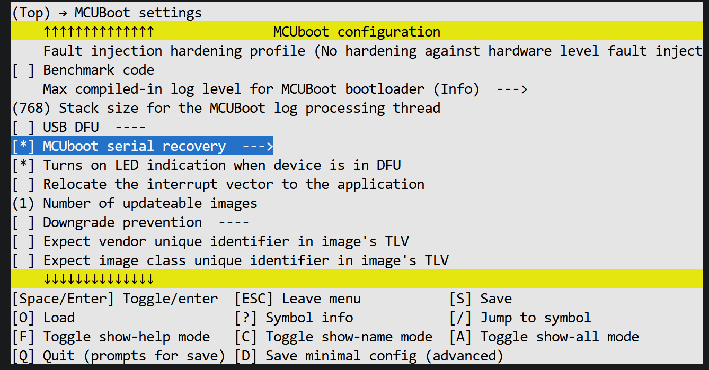
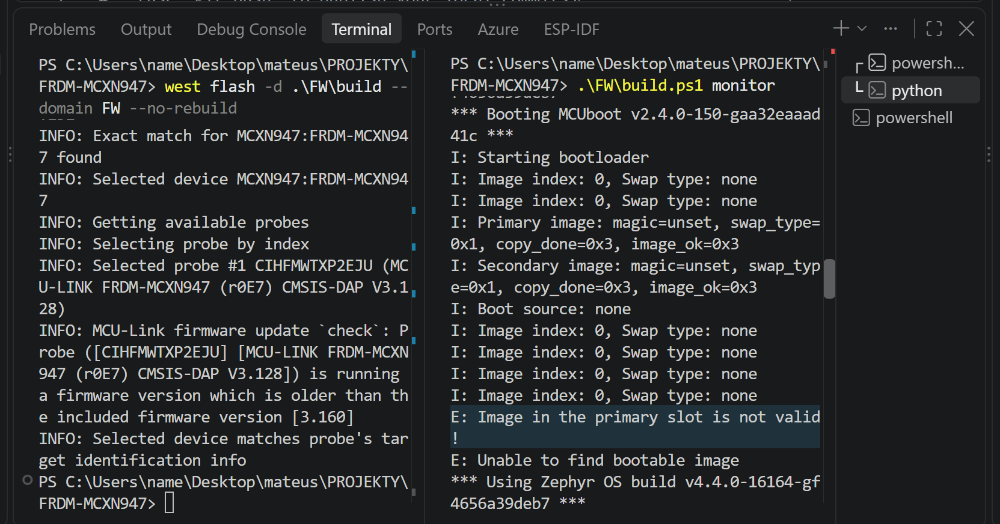
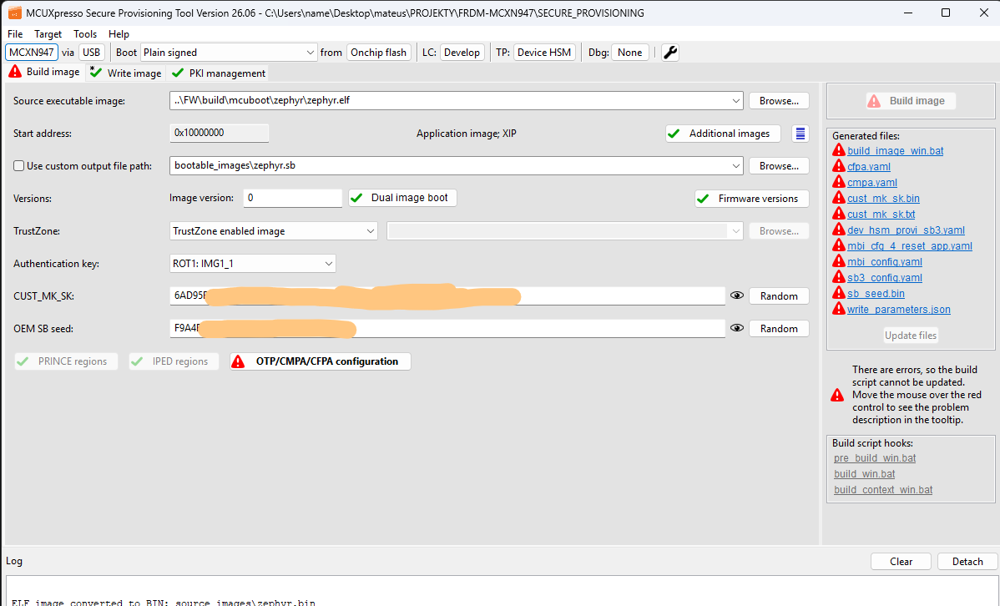
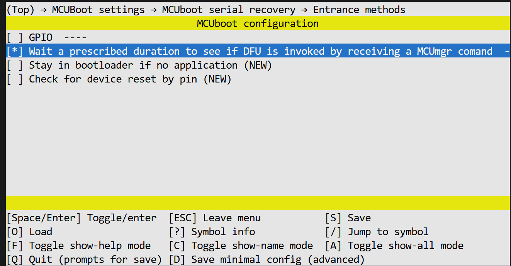

## Security Testing

The security testing phase covers MCUboot-based firmware authentication, firmware update handling, and the hardware security features of the MCXN947.

### MCUboot

MCUboot has been integrated into the Zephyr application using Sysbuild.

The configuration enables MCUboot with:

```text
SB_CONFIG_BOOTLOADER_MCUBOOT=y
```

MCUboot was successfully flashed to the MCXN947 and verified to chainload the application.

The bootloader reports the application chainload address:

```text
Bootloader chainload address offset: 0x14000
```

and successfully starts the Zephyr application.

The resulting boot flow is:

```text
MCUboot
   ↓
Zephyr application
```

### MCUboot Serial Recovery Configuration

MCUboot serial recovery was enabled through:

```text
FW/sysbuild/mcuboot.conf
```

The relevant configuration includes:

```text
CONFIG_MCUBOOT_SERIAL=y
CONFIG_BOOT_SERIAL_UART=y
CONFIG_BOOT_SERIAL_WAIT_FOR_DFU=y
CONFIG_BOOT_SERIAL_WAIT_FOR_DFU_TIMEOUT=5000
CONFIG_MCUBOOT_SERIAL_DIRECT_IMAGE_UPLOAD=y
CONFIG_BOOT_SERIAL_IMG_GRP_HASH=y
CONFIG_BOOT_SERIAL_IMG_GRP_IMAGE_STATE=y
```

The serial recovery interface uses UART at:

```text
COM3
115200 baud
```

Direct image upload is enabled so that MCUboot can receive an image through the MCUmgr serial transport.

The secondary image slot is used for firmware update testing.

### Firmware Signing

Firmware signing has been enabled.

A project-specific RSA-2048 key pair was generated using the MCUboot `imgtool` utility.

The private signing key is stored locally in:

```text
keys/mcuboot-rsa-2048.pem
```

The private key is not intended to be stored in the firmware image or committed to the repository.

Private key files are excluded from Git using:

```text
*.pem
*.key
```

The project configuration points to the project-specific signing key:

```text
SB_CONFIG_BOOT_SIGNATURE_KEY_FILE="C:/Users/name/Desktop/mateus/PROJEKTY/FRDM-MCXN947/keys/mcuboot-rsa-2048.pem"
```

The generated signed application image is:

```text
FW/build/FW/zephyr/zephyr.signed.bin
```

The build configuration confirms that the project-specific RSA-2048 key is used for image signing.

### Signature Verification

The signed firmware was flashed together with MCUboot.

After programming, MCUboot successfully processed the image and chainloaded the application:

```text
I: Bootloader chainload address offset: 0x14000
I: Image version: v0.0.0
I: Jumping to the first image slot
*** Booting Zephyr OS build ...
Hello World from my own MCXN947 project!
```

This confirms the positive boot path:

```text
Build
  ↓
Firmware signing
  ↓
MCUboot
  ↓
Image validation
  ↓
Application
```



### Modified Firmware Rejection

A negative security test was performed to verify that modification of a signed firmware image is detected by MCUboot.

First, a known-good signed firmware image was preserved:

```text
FW/build/FW/zephyr/zephyr.signed.backup.bin
```

A copy of the signed firmware was then modified by changing a single byte.

The modified image was flashed without rebuilding the application.

During the subsequent boot attempt, MCUboot rejected the modified image:

```text
E: Image in the primary slot is not valid!
E: Unable to find bootable image
```

The application was therefore not chainloaded from the modified image.

The original signed image was restored. Its SHA-256 hash was verified:

```text
6B032496CBCE4F0E9768B0731C3957DB6F750B0CD4B30391C7468A909D17810C
```

The restored image matched the known-good firmware hash.



**Result: PASS**

This test demonstrates that modification of a signed firmware image causes MCUboot image validation to fail and prevents the modified image from being booted.

### Good and Bad Firmware Image Verification

A separate good/bad image test was performed using MCUboot `imgtool`.

The known-good signed image was copied to:

```text
test_images/firmware-good.bin
```

The image was verified using the MCUboot `imgtool` utility:

```text
python imgtool.py verify test_images/firmware-good.bin
```

The result was:

```text
Image was correctly validated
Image version: 0.0.0+0
```

**Good firmware: PASS**

A second copy was modified by changing one byte after signing:

```text
test_images/firmware-bad.bin
```

Verification of the modified image produced:

```text
Image has an invalid hash
```

**Bad firmware: PASS**

The modified image was also uploaded through MCUboot serial recovery. The transport upload completed successfully, but MCUboot did not report the image as bootable in `image list`.

This confirms the distinction between successful transport and successful image validation:

```text
Successful transport upload
        ≠
Valid firmware image
```

The firmware image must still pass MCUboot validation before it can be used for boot.

### Hardware Secure Boot

The MCXN947 hardware security features were subsequently investigated using the NXP MCUXpresso Secure Provisioning Tool.

A Secure Provisioning workspace was created for the FRDM-MCXN947.

The selected security configuration was:

```text
Plain signed image running on onchip flash
```

The provisioning process generated and configured hardware security assets including:

* Chain of Trust / Root of Trust key material
* Image authentication key material
* Customer Manufacturing Key
* Secure Boot configuration
* CMPA configuration
* CFPA configuration

The Secure Provisioning Tool generated secure boot images and provisioning data, including:

```text
SECURE_PROVISIONING/bootable_images/zephyr.bin
SECURE_PROVISIONING/bootable_images/zephyr.sb
SECURE_PROVISIONING/bootable_images/dev_hsm_provisioning.sb
SECURE_PROVISIONING/bootable_images/MCXN_ram_reset_app.bin
```

The device was provisioned in development lifecycle mode.

The provisioning process successfully installed the required security assets and loaded the secure boot image.



After reset, the device successfully booted through the existing MCUboot software boot stage and started the Zephyr application.

This confirms that hardware security provisioning can coexist with the existing MCUboot-based software boot chain.

### Boot Chain

The current security architecture can be represented as:

```text
MCXN947 ROM / Hardware Secure Boot
              ↓
       Secure boot image
              ↓
           MCUboot
              ↓
       MCUboot RSA-2048
              ↓
        Zephyr application
```

The hardware Secure Boot mechanism and MCUboot firmware authentication are separate security layers.

The hardware Secure Boot mechanism establishes the initial hardware-enforced trust chain, while MCUboot performs software-level authentication of the application image using the project-specific MCUboot signing key.

The exact relationship between the hardware Root of Trust, the Secure Provisioning configuration, and the MCUboot RSA key is still under investigation.

### Firmware Update Mechanism

A functional MCUboot firmware update mechanism has been implemented and tested using MCUboot serial recovery over UART.

The tested update flow is:

```text
New firmware
    ↓
MCUboot image signing
    ↓
MCUmgr serial transport
    ↓
MCUboot secondary slot
    ↓
Image validation
    ↓
image test / pending state
    ↓
Device reset
    ↓
Image swap
    ↓
New primary image
    ↓
Image confirmed
```

The MCUboot partition layout used by the project is:

```text
MCUboot:
    0x10000000 - 0x10013FFF

Primary image slot:
    0x10014000 - 0x10109FFF

Secondary image slot:
    0x1010A000 - 0x101FFFFF
```

For the configured swap-offset mechanism, the uploaded secondary image is stored with the MCUboot swap offset.

MCUboot serial recovery was tested using `mcumgr`.

The secondary image was uploaded using:

```text
mcumgr -c mcxn image upload firmware-good.bin -n 2
```

The image was then visible in the secondary slot.

Before the update:

```text
image=0 slot=0
    flags: active confirmed

image=0 slot=1
    flags:
```

After marking the secondary image for testing:

```text
image=0 slot=0
    flags: confirmed

image=0 slot=1
    flags: pending
```

After reset, MCUboot performed the update and the resulting state was:

```text
image=0 slot=0
    flags: active confirmed

image=0 slot=1
    flags:
```

This confirms successful use of the MCUboot secondary slot and image swap mechanism.



### Firmware Update Security

The firmware update mechanism was tested with both valid and modified firmware images.

A valid signed image was successfully uploaded to the secondary slot, marked as pending, and accepted by MCUboot after reset.

The modified firmware image was created by changing one byte after signing.

The modified image failed image verification:

```text
Image has an invalid hash
```

and was not reported by MCUboot as a bootable secondary image.

This demonstrates that the MCUboot image validation mechanism remains active during the firmware update process.

### Root of Trust

The project distinguishes between several layers of trust:

1. The private signing key used to create MCUboot firmware signatures.
2. The trusted public-key material used by MCUboot to verify firmware signatures.
3. MCUboot as the software boot stage responsible for validating application images.
4. The hardware Root of Trust used by the MCXN947 Secure Boot mechanism.
5. Hardware security configuration and lifecycle state controlling access to protected device functionality.

The private MCUboot signing key remains outside the firmware image and is not committed to the repository.

The hardware Secure Boot configuration is treated separately from the MCUboot application-signing key.

No further irreversible security configuration, OTP programming, lifecycle transition, or security fuse programming will be performed without first documenting the configuration and understanding its recovery implications.

### Security Tests — Completed

* [x] MCUboot integration
* [x] Firmware signing
* [x] Project-specific RSA-2048 signing key
* [x] Signed firmware successfully booted through MCUboot
* [x] Modified firmware rejection test
* [x] Good firmware image verification
* [x] Bad firmware image verification
* [x] MCUXpresso Secure Provisioning Tool setup
* [x] Hardware security provisioning in development lifecycle
* [x] Hardware Secure Boot configuration
* [x] Secure boot image successfully generated
* [x] Provisioned device successfully booted
* [x] MCUboot serial recovery/update mechanism
* [x] Firmware upload to MCUboot secondary slot
* [x] MCUboot image test / pending state
* [x] MCUboot image swap
* [x] Firmware update confirmation
* [x] Firmware modification rejection during update

### Security Tests — Planned

* [ ] Image version and downgrade protection
* [ ] Invalid signature test using a different signing key
* [ ] Wrong public key / wrong signing key test
* [ ] Hardware cryptographic feature testing
* [ ] Memory protection testing
* [ ] Access control testing
* [ ] Debug/security lifecycle testing
* [ ] Hardware Root of Trust investigation
* [ ] Detailed relationship between hardware Secure Boot and MCUboot authentication
* [ ] Additional MCXN947 security feature testing

Each security mechanism will be investigated and tested individually.

The results, configuration, test procedure, expected behavior, observed behavior, and conclusions will be documented in this repository.

## Project Status

* [x] MCUXpresso IDE
* [x] LinkServer
* [x] Zephyr RTOS
* [x] Zephyr SDK
* [x] Zephyr sample application
* [x] Custom Zephyr application
* [x] Build
* [x] Flash
* [x] UART
* [x] MCUboot
* [x] Firmware signing
* [x] Project-specific RSA-2048 signing key
* [x] Signed firmware successfully booted through MCUboot
* [x] Modified firmware rejection test
* [x] Good/bad firmware image verification
* [x] MCUXpresso Secure Provisioning setup
* [x] Hardware security provisioning
* [x] Hardware Secure Boot configuration
* [x] Secure boot image generated
* [x] Provisioned device successfully booted
* [x] MCUboot firmware update mechanism
* [x] MCUboot serial recovery/update
* [x] MCUboot secondary slot update
* [x] MCUboot image test / pending state
* [x] MCUboot image swap
* [x] Firmware modification rejection during update
* [ ] Invalid signature test using a different signing key
* [ ] Wrong public key / wrong signing key test
* [ ] Image downgrade protection test
* [ ] Hardware cryptographic feature testing
* [ ] Memory protection testing
* [ ] Access control testing
* [ ] Debug/security lifecycle testing
* [ ] Hardware Root of Trust investigation
* [ ] Hardware Secure Boot / MCUboot interaction testing
* [ ] Other MCXN947 security feature testing
